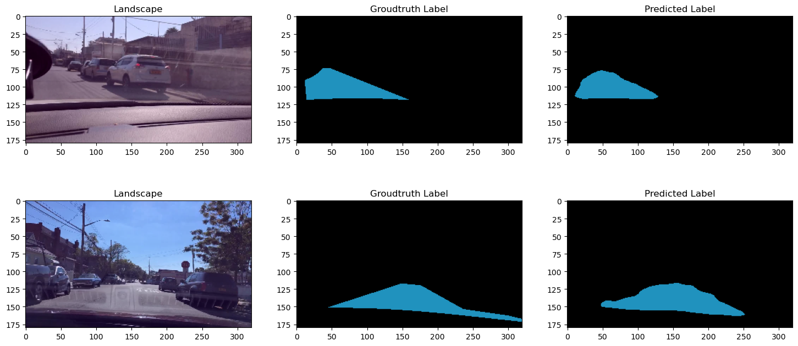

 **#  # DeepLabv3+ for Semantic Segmentation in Autonomous Driving**

**## Overview**

This repository contains the code and resources for implementing a DeepLabv3+ architecture for autonomous driving tasks. The goal is to leverage DeepLabv3+ capabilities in semantic segmentation to enhance the perception and decision-making abilities of a self-driving vehicle.


**## Architecture**


**## Key Features**

* Implementation of DeepLabv3+ architecture in PyTorch
* Training and evaluation on autonomous driving - Cityscapes Dataset
* Exploration of real-time inference for on-board deployment

**## Setup**

1. Clone the repository:

   ```bash
   git clone https://github.com/mayB1998/DeeplabV3-Autonomous_Driving.git
   ```

2. Install dependencies:

   ```bash
   pip install -r requirements.txt
   ```

**## Usage**

1. Download dataset: 
2. Train the model: (Provide example training command)
3. Evaluate performance: (Provide example evaluation command)
4. Visualize results: (Provide instructions on visualizing segmentation outputs)

**## Project Structure**

```
deeplabv3plus-autonomous-driving/
├── README.md                        <-- This file
├── requirements.txt                 <-- List of dependencies
├── dataset/                         <-- Datasets
│   ├── cityscapes/                  <-- Example dataset
│   └── kitti/                       <-- Example dataset
├── output/                          <-- Model output and logs
├── model.py                         <-- Main DeepLabv3+ model file
├── train.py                         <-- Training script
├── evaluate.py                      <-- Evaluation script
├── utils.py                         <-- Utility functions
└── LICENSE                          <-- License information
```

**## results**


The image above shows the image and the corresponding label for the Drivable area


The above image shows the output achieved and the corresponding label, along with the image for the segemantation task performed with the Unet architecture


Validation and Training curve for the model trained

**## Additional Information**

* Datasets used:  
* Framework:
* Hardware requirements:         
* Expected performance metrics:
* Future work:                   
